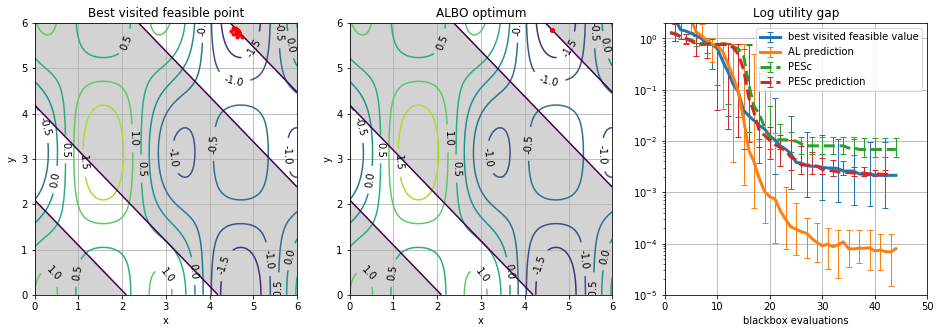

ALBO is an experimental application of Augmented Lagrangians for constrained Bayesian Optimization implemented in BoTorch

Toy problem from Gramacy et al. 2016


Simulation 1 from Gardner et al. 2014



## Algorithm

See [report draft](report/report_draft.ipynb) for details

## Installation
```
git clone https://github.com/stys/albo
cd albo
conda env create -f environment.yml
conda activate albo
pip install -e .
```

## Example
```
from torch import Tensor
from botorch.sampling.samplers import SobolQMCNormalSampler

from albo.acquisition.objective import ClassicAugmentedLagrangianMCObjective
from albo.optim.optimize import AlboOptimizer
from albo.test_functions.synthetic import GardnerTestFunction

blackbox = GardnerTestFunction()
bounds = Tensor(blackbox._bounds)

objective = ClassicAugmentedLagrangianMCObjective(
    objective=lambda y: y[..., 0],
    constraints=[
        lambda y: y[..., 1]
    ],
    r=100.0
)

sampler = SobolQMCNormalSampler(num_samples=1500)

optimizer = AlboOptimizer(
    blackbox=blackbox,
    objective=objective,
    sampler=sampler,
    bounds=bounds
)

x_best, y_best, trace = optimizer.optimize(niter=50, init_samples=10, al_iter=10)
